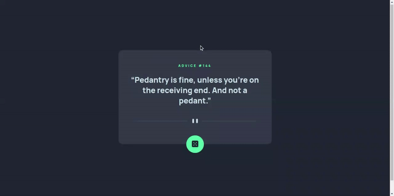

# Frontend Mentor - Advice generator app solution

This is a solution to the [Advice generator app challenge on Frontend Mentor](https://www.frontendmentor.io/challenges/advice-generator-app-QdUG-13db). Frontend Mentor challenges help you improve your coding skills by building realistic projects.

## Table of contents

- [Overview](#overview)
  - [The challenge](#the-challenge)
  - [Demo](#demo)
  - [Links](#links)
- [My process](#my-process)
  - [Built with](#built-with)
  - [What I learned](#what-i-learned)
  - [Useful resources](#useful-resources)
- [Author](#author)

## Overview

### The challenge

Users should be able to:

- View the optimal layout for the app depending on their device's screen size
- See hover states for all interactive elements on the page
- Generate a new piece of advice by clicking the dice icon

### Demo

<details open>
  <summary>Desktop</summary>
  
</details>

### Links

- [Preview site](https://alberto-rj.github.io/advice-generator-app/)
- [Preview solution on Frontend Mentor](https://your-live-site-url.com)

## My process

### Built with

- Semantic HTML5 markup
- CSS custom properties
- Flexbox
- Mobile-first workflow
- Vanilla JavaScript (DOM, Fetch API)

### What I learned

- **Values `open-quote` and `close-quote` of the CSS property `content`**
  - `open-quote` - Sets the content to be an opening quote.
  - `close-quote` - Sets the content to be a closing quote.

  - **HTML**

    ```html
    <p>Hello World</p>
    ```

  - **CSS**
  
    ```css
    p::before {
      content: open-quote;
    }

    p::after {
      content: close-quote;
    }
    ```

  - **Result - after page load**

    *"Hello World"*

- **HTML DOM Element `cloneNode()` method:**
  - The `cloneNode()` method creates a copy of a node, and returns the clone.
  - The `cloneNode()` method clones all attributes and their values.
  - Set the deep parameter to `true` if you also want to clone descendants (children).
  
  - **HTML**

    ```html
    <div id="hello">
      <p>Hello</p>
    </div>
    <div id="world">
      <p>World</p>
    </div>
    ```

  - **JavaScript**
  
    ```js
    const hello = document.getElementById('hello');
    const world = document.getElementById('world');
    console.log(hello.cloneNode(false)); // <div id="hello"></div>
    console.log(world.cloneNode(true)); // <div id="world"><p>World</p></div>
    ```

- **`<template>` HTML tag** - Used as a container to hold some HTML content hidden from the user when the page loads.

  - **HTML**

    ```html
    <button onclick="showContent()">Show hidden content</button>
    <template id="myTemplate">
      <p>This paragraph is hidden from the user by default</p>
    <template>
    ```

  - **JavaScript**
  
    ```js
    function showContent() {
      var template = document.getElementById("myTemplate");
      var p = template.content.cloneNode(true);
      document.body.appendChild(p);
    }
    ```

  - **Result - after calling the `showContent()` method**

    ```html
    <button onclick="showContent()">Show hidden content</button>
    <template id="myTemplate">
      <p>This paragraph is hidden from the user by default</p>
    <template>
    <p>This paragraph is hidden from the user by default</p>
    ```

### Useful resources

- [Advice Slip JSON API](https://api.adviceslip.com/) - The Advice Slip JSON API is provided for free. It currently gives out over 10 million pieces of advice every year. It was used in this solution as a recommendation from Frontend Mentor.

- [Skeleton Loader Example – How to Build a Skeleton Screen with CSS for Better UX](https://www.freecodecamp.org/news/how-to-build-skeleton-screens-using-css-for-better-user-experience/) - Article written by [Israel Mitolu](https://www.freecodecamp.org/news/author/israelmitolu/). He helped me understand what it is, why, when and how to implement a Skeleton Loader in a project. I really liked this pattern and will use it going forward.

- [How to Create a Shimmer Effect Using HTML and CSS?](https://www.codeguage.com/blog/shimmer-effect-html-css) - This is an amazing article from [Codeguage](https://www.codeguage.com) which helped me implement the simmer effect. I would recommend it to anyone who needs to implement this in their project.

- [W3Schools: CSS `content` Property](https://www.w3schools.com/cssref/pr_gen_content.php) - This is a complete reference to the `content` property on W3Schools. I especially used it to get more details about the `open-quote` and `close-quote` values.

- [W3Schools: HTML DOM Element `cloneNode()` Method](https://www.w3schools.com/jsref/met_node_clonenode.asp) - I used this reference to the `cloneNode()` method on W3Schools to get more details about it.

- [W3Schools: HTML `<template>` tag](https://www.w3schools.com/tags/tag_template.asp) - This is a complete reference to the `<template>` tag on W3Schools. I especially used it to get more details on how to use it together with JavaScript.

## Author

- GitHub - [alberto-rj](https://github.com/alberto-rj)
- Frontend Mentor - [@alberto-rj](https://www.frontendmentor.io/profile/alberto-rj)
- Twitter - [@albertorauljose](https://www.twitter.com/albertorauljose)
