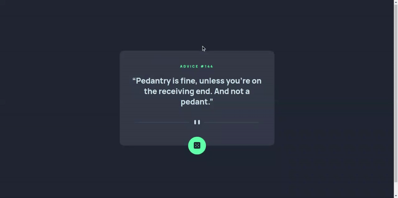

<div align="center">

  <h1 align="center">Advice Generator App</h1>

  <p align="center">
    A single-page app that fetches random advice from a public API, with a skeleton loading screen for perceived performance - built as a <a href="https://www.frontendmentor.io/challenges/advice-generator-app-QdUG-13db"><strong>Frontend Mentor</strong></a> challenge.
    <br /><br />
    <a href="https://alberto-rj.github.io/advice-generator-app/"><strong>View Live</strong></a>
    &nbsp;&nbsp;·&nbsp;&nbsp;
    <a href="https://www.frontendmentor.io/solutions/advice-generator-app-with-skeleton-screen-R0xlL__Bdj">View on Frontend Mentor</a>
  </p>

  <br />

  
  &nbsp;
  <a href="https://www.frontendmentor.io/challenges?difficulties=1">
    
  </a>

</div>

<br />



<br />

## About the Project

This app hits the [Advice Slip API](https://api.adviceslip.com/) on demand and displays a new piece of advice each time the user clicks the dice button. The main technical focus was handling the async data fetch gracefully - rather than showing a blank card while waiting, I implemented a **skeleton loading screen** with a shimmer animation, which makes the app feel faster and more polished even on slow connections.

**Stack:** HTML5 · CSS3 · JavaScript (Fetch API) · Git

<br />

## Key Technical Decisions

- **Skeleton screen over a spinner:** A spinner communicates "waiting." A skeleton screen communicates the *shape* of what's coming, which anchors the user's attention and reduces perceived load time. For a card-based UI like this one, the skeleton approach was a better fit and something I wanted to learn properly.

- **`<template>` tag for the skeleton markup:** Rather than building the skeleton element with `innerHTML` strings in JavaScript, I used the HTML `<template>` tag with `cloneNode(true)` to inject it into the DOM. This keeps the skeleton markup in HTML where it belongs, out of JS, and makes it easier to update later without touching the script.

- **CSS `open-quote` / `close-quote`:** The design calls for typographic quotation marks around the advice text. Rather than hardcoding `"` characters in the JS string (which breaks if the API response contains quotes), I used CSS `content: open-quote` and `close-quote` on `::before` / `::after` pseudo-elements. The quotes become a presentational concern handled entirely in CSS.

<br />

## Challenges & What I Learned

- **Implementing the skeleton screen from scratch:** I hadn't used this pattern before. The core idea — show placeholder elements with the same dimensions as the real content, animate them with a shimmer gradient, then swap them out on load - was straightforward once I understood it. The tricky part was matching the skeleton's proportions to the actual content closely enough that the transition doesn't cause layout shift.

- **Managing async state without a framework:** Without React's state model, I had to be explicit about every UI transition: show skeleton → fetch → hide skeleton → show content → handle error. It was a good exercise in thinking through all possible states of a UI component, not just the happy path. I added an error state that I initially forgot entirely.

- **What I'd do differently:** I'd abstract the fetch logic into a separate function that returns a Promise resolving to the advice data, rather than mixing the fetch call with DOM updates in the same function. Separating the data layer from the UI layer would make both easier to read and test - a lesson I carried into later projects.

<br />

## Running Locally

```bash
git clone https://github.com/alberto-rj/advice-generator-app.git
cd advice-generator-app
```

Open `index.html` in your browser. No build step or dependencies required. The app calls the Advice Slip API directly from the browser - no API key needed.

<br />

## Author

- GitHub - [@alberto-rj](https://github.com/alberto-rj)
- Frontend Mentor - [@alberto-rj](https://www.frontendmentor.io/profile/alberto-rj)
- Twitter - [@albertorauljose](https://twitter.com/albertorauljose)

<br />

---

Challenge by [Frontend Mentor](https://www.frontendmentor.io).
